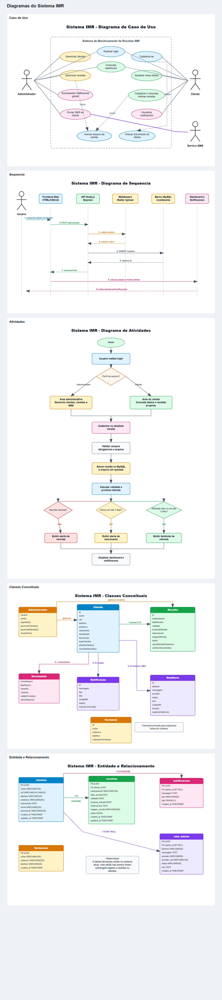
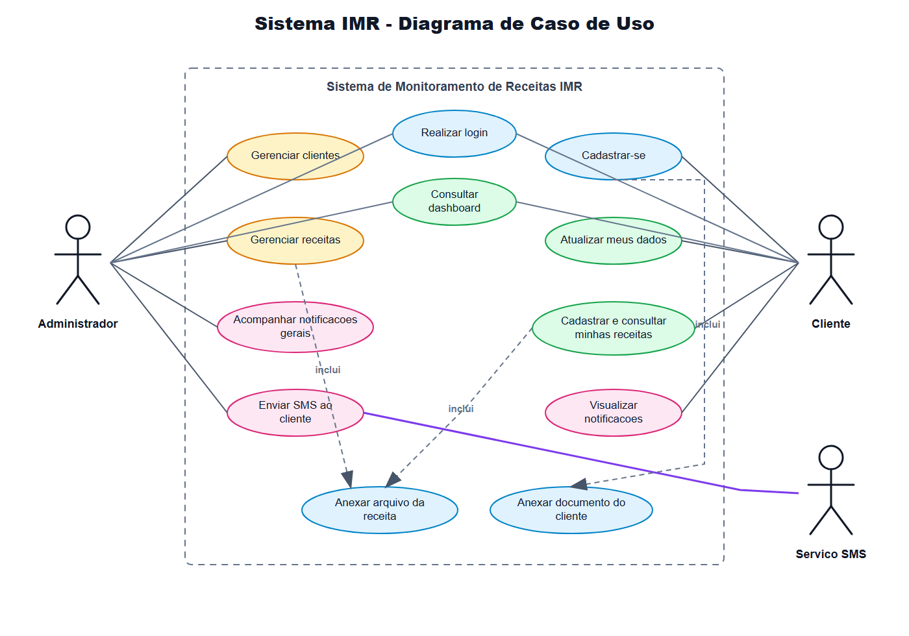
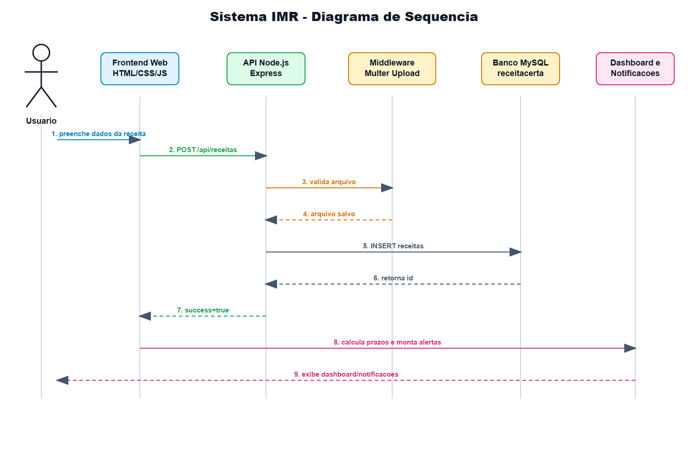
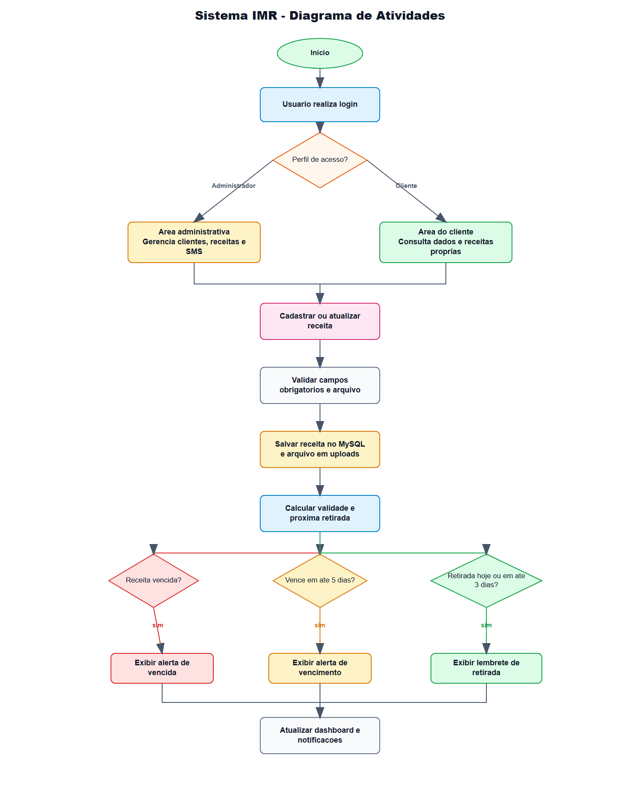
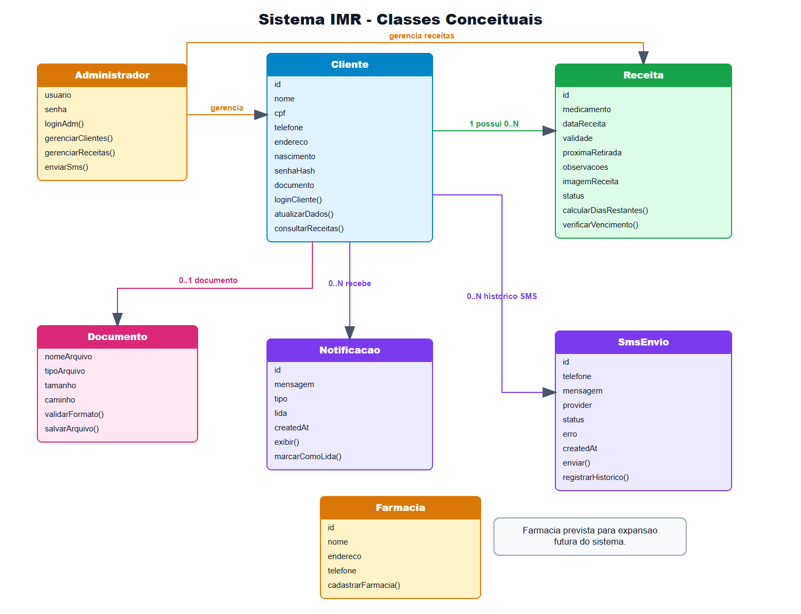
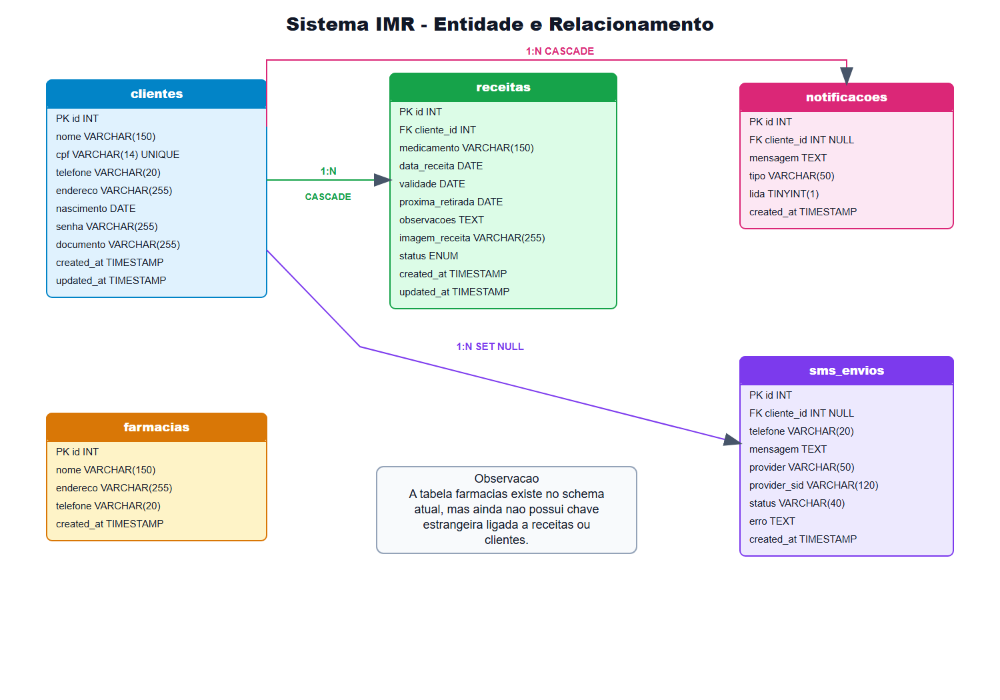

# Diagramas do Sistema IMR

Esta página reúne os diagramas atualizados do Sistema de Monitoramento de Receitas IMR.

## Todos os Diagramas

## Caso de Uso

## Sequência

## Atividades

## Classes Conceituais

## Entidade e Relacionamento

## Arquivos Editáveis

Os arquivos editáveis do Draw.io estão na pasta [`diagramas_drawio`](diagramas_drawio/).

Arquivo principal editável:

[`IMR_DIAGRAMAS_MODELAGEM_ATUALIZADOS.drawio`](diagramas_drawio/IMR_DIAGRAMAS_MODELAGEM_ATUALIZADOS.drawio)
